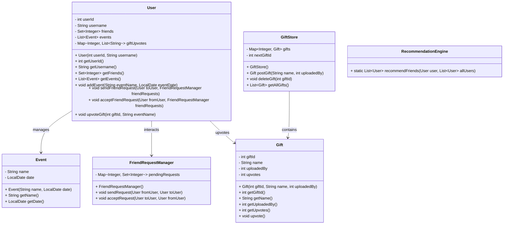

```java
import java.util.*;
import java.time.LocalDate;

class User {
    private int userId;
    private String username;
    private Set<Integer> friends;
    private List<Event> events;
    private Map<Integer, List<String>> giftUpvotes; // giftId -> event names

    public User(int userId, String username) {
        this.userId = userId;
        this.username = username;
        this.friends = new HashSet<>();
        this.events = new ArrayList<>();
        this.giftUpvotes = new HashMap<>();
    }

    public int getUserId() {
        return userId;
    }

    public String getUsername() {
        return username;
    }

    public Set<Integer> getFriends() {
        return friends;
    }

    public List<Event> getEvents() {
        return events;
    }

    public void addEvent(String eventName, LocalDate eventDate) {
        events.add(new Event(eventName, eventDate));
    }

    public void sendFriendRequest(User toUser, FriendRequestManager friendRequests) {
        friendRequests.sendRequest(this, toUser);
    }

    public void acceptFriendRequest(User fromUser, FriendRequestManager friendRequests) {
        friendRequests.acceptRequest(this, fromUser);
    }

    public void upvoteGift(int giftId, String eventName) {
        giftUpvotes.putIfAbsent(giftId, new ArrayList<>());
        if (eventName != null) {
            giftUpvotes.get(giftId).add(eventName);
        }
    }
}

class Event {
    private String name;
    private LocalDate date;

    public Event(String name, LocalDate date) {
        this.name = name;
        this.date = date;
    }

    public String getName() {
        return name;
    }

    public LocalDate getDate() {
        return date;
    }
}

class FriendRequestManager {
    private Map<Integer, Set<Integer>> pendingRequests;

    public FriendRequestManager() {
        this.pendingRequests = new HashMap<>();
    }

    public void sendRequest(User fromUser, User toUser) {
        if (!fromUser.getFriends().contains(toUser.getUserId())) {
            pendingRequests.putIfAbsent(toUser.getUserId(), new HashSet<>());
            pendingRequests.get(toUser.getUserId()).add(fromUser.getUserId());
        }
    }

    public void acceptRequest(User toUser, User fromUser) {
        Set<Integer> requests = pendingRequests.get(toUser.getUserId());
        if (requests != null && requests.contains(fromUser.getUserId())) {
            requests.remove(fromUser.getUserId());
            toUser.getFriends().add(fromUser.getUserId());
            fromUser.getFriends().add(toUser.getUserId());
        }
    }
}

class Gift {
    private int giftId;
    private String name;
    private int uploadedBy;
    private int upvotes;

    public Gift(int giftId, String name, int uploadedBy) {
        this.giftId = giftId;
        this.name = name;
        this.uploadedBy = uploadedBy;
        this.upvotes = 0;
    }

    public int getGiftId() {
        return giftId;
    }

    public String getName() {
        return name;
    }

    public int getUploadedBy() {
        return uploadedBy;
    }

    public int getUpvotes() {
        return upvotes;
    }

    public void upvote() {
        upvotes++;
    }
}

class GiftStore {
    private Map<Integer, Gift> gifts;
    private int nextGiftId;

    public GiftStore() {
        this.gifts = new HashMap<>();
        this.nextGiftId = 1;
    }

    public Gift postGift(String name, int uploadedBy) {
        Gift gift = new Gift(nextGiftId, name, uploadedBy);
        gifts.put(nextGiftId, gift);
        nextGiftId++;
        return gift;
    }

    public void deleteGift(int giftId) {
        gifts.remove(giftId);
    }

    public List<Gift> getAllGifts() {
        return new ArrayList<>(gifts.values());
    }
}

class RecommendationEngine {
    public static List<User> recommendFriends(User user, List<User> allUsers) {
        List<User> recommendations = new ArrayList<>();
        for (User u : allUsers) {
            if (!user.getFriends().contains(u.getUserId()) && user.getUserId() != u.getUserId()) {
                recommendations.add(u);
            }
        }
        return recommendations;
    }
}

public class GiftBuyingStore {
    public static void main(String[] args) {
        // Initialize the system
        List<User> users = new ArrayList<>();
        FriendRequestManager friendRequests = new FriendRequestManager();
        GiftStore giftStore = new GiftStore();

        // Create users
        User user1 = new User(1, "Alice");
        User user2 = new User(2, "Bob");
        User user3 = new User(3, "Charlie");
        users.add(user1);
        users.add(user2);
        users.add(user3);

        // Friend requests
        user1.sendFriendRequest(user2, friendRequests);
        user2.acceptFriendRequest(user1, friendRequests);

        // Events
        user1.addEvent("Birthday", LocalDate.of(2025, 5, 15));
        user2.addEvent("Anniversary", LocalDate.of(2025, 8, 20));

        // Gift store
        Gift gift1 = giftStore.postGift("Smartphone", user1.getUserId());
        Gift gift2 = giftStore.postGift("Laptop", user2.getUserId());

        user2.upvoteGift(gift1.getGiftId(), "Birthday");
        gift1.upvote();

        // Recommendations
        List<User> recommendations = RecommendationEngine.recommendFriends(user1, users);
        System.out.println("Recommended Friends for Alice:");
        for (User u : recommendations) {
            System.out.println(u.getUsername());
        }

        // Display
        System.out.println("User1 Events:");
        for (Event e : user1.getEvents()) {
            System.out.println(e.getName() + " on " + e.getDate());
        }

        System.out.println("Gift Store Items:");
        for (Gift g : giftStore.getAllGifts()) {
            System.out.println(g.getName() + " with upvotes: " + g.getUpvotes());
        }
    }
}
```
